# Installation

This block will need to be constructed before it can be used

* Clone this repo into your plugins or mu-plugins directory.
* Run `composer install --no-dev && npm install` to install all needed dependencies.  
* You can then run 'npm run start` to build the production version of the block.  

> *If this is built as a plugin, please activate in wp-admin*

# Creating a Donation Button

## First head over to your paypal site and create a button
Log into PayPal and access the donations section (under Pay & Get Paid)
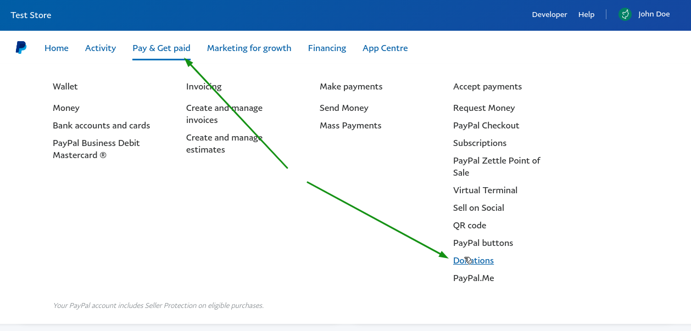

## Create a new button
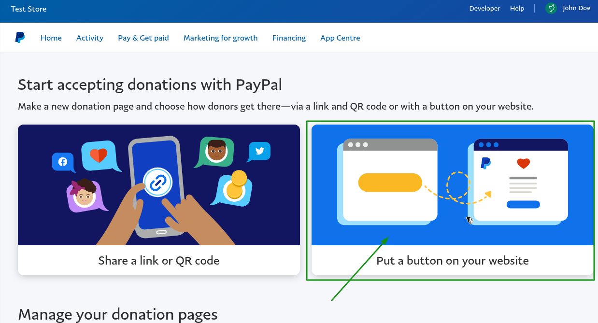

## Enter your location and language. Do not worry about button size or using a custom image (unless you wish to also use this elsewhere)
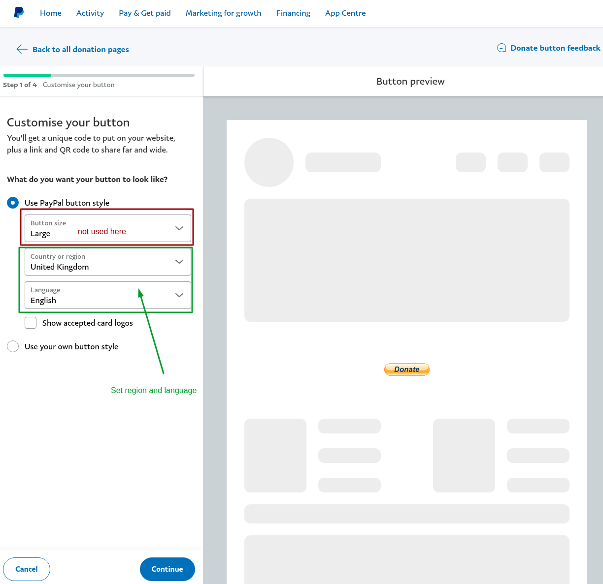

## You can choose to show your logo and custom header image.
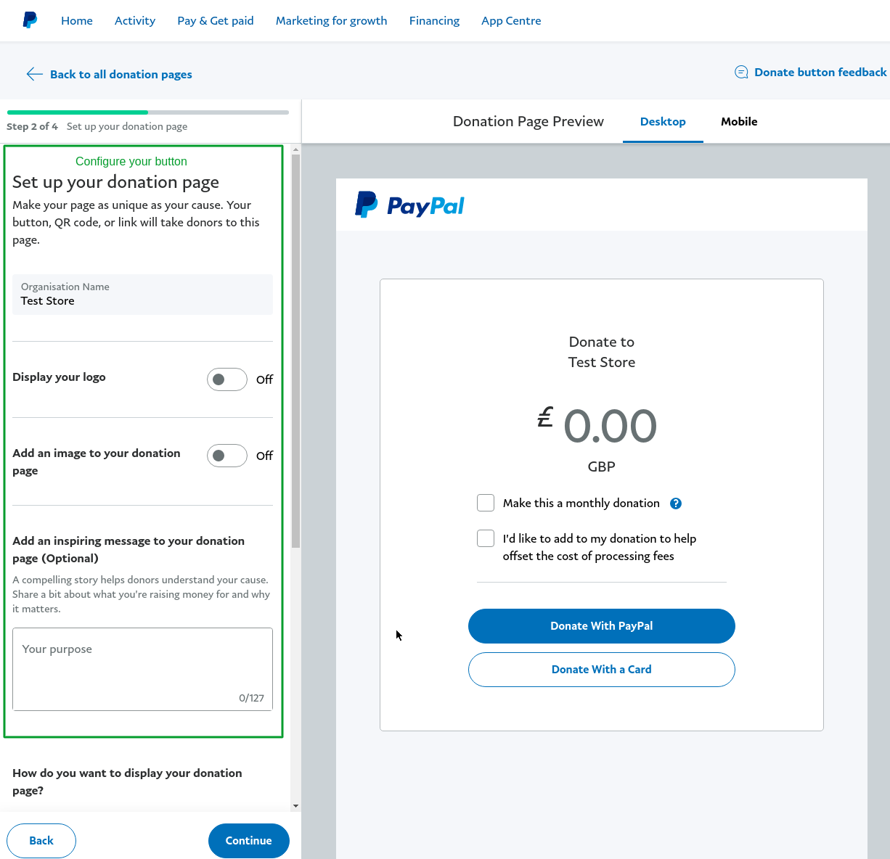

## Choose to load this donation block as popup.
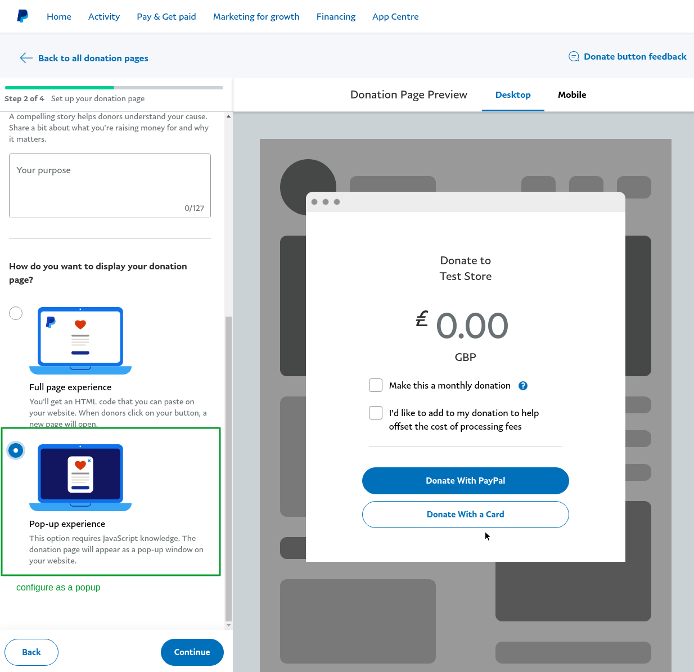

## Configure what options the user has for donation amounts etc.
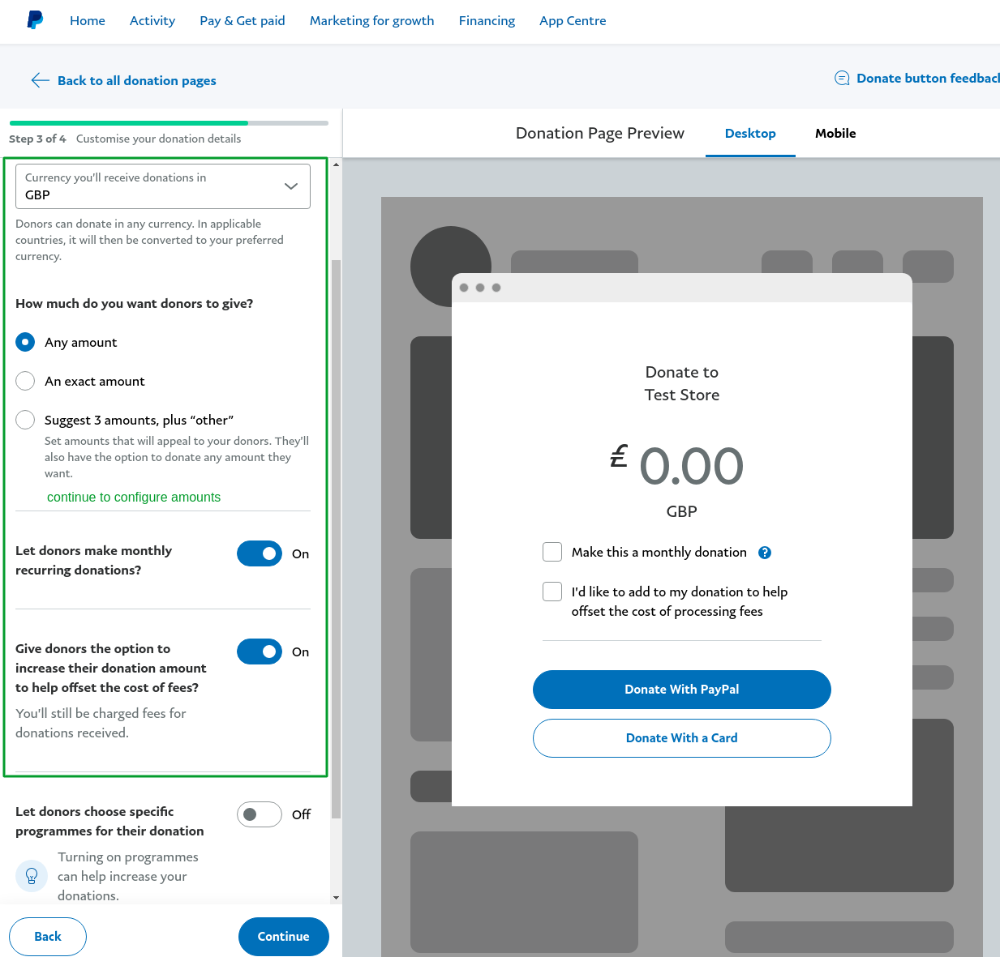

## Choose which details you wish to collect from the user
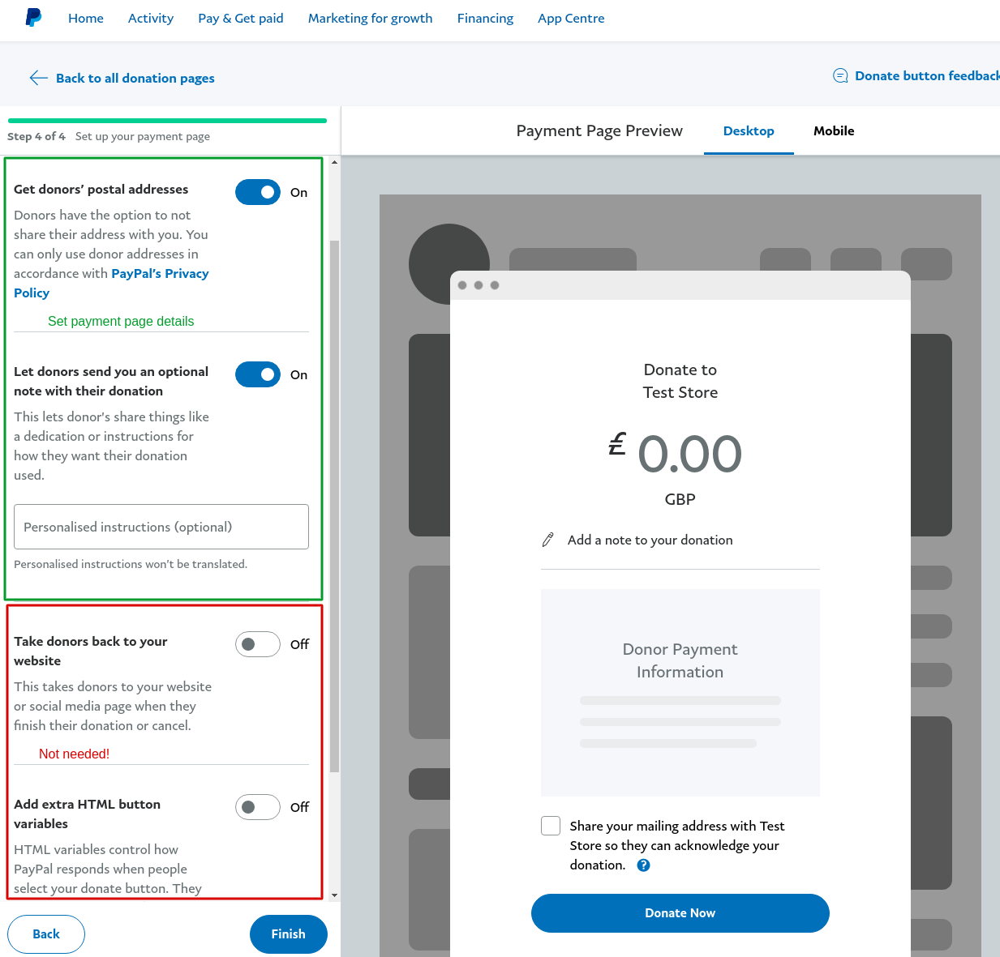

## Once you have created your button, you should see the embed code, copy just the hosted_button_id
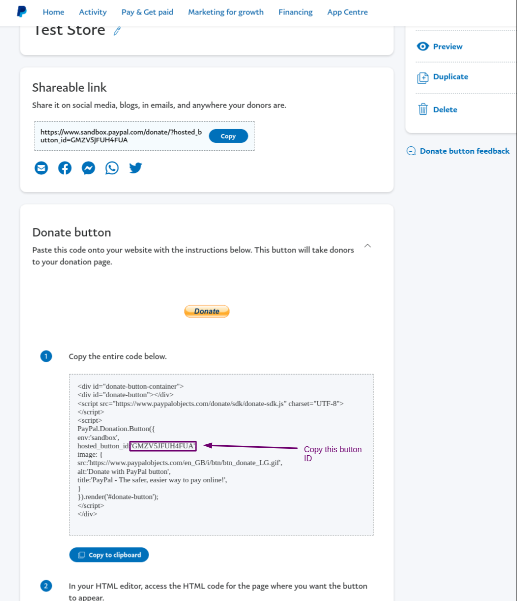

## You can then use the host_button_id value to either create a block or shortcode (for use in none post/page contents)
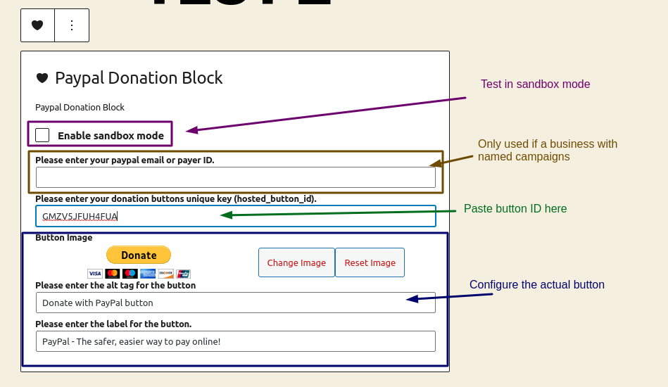

## To use as a shortcode please enter `[paypal_donation_block hosted_button_id='{host_button_id}']`.
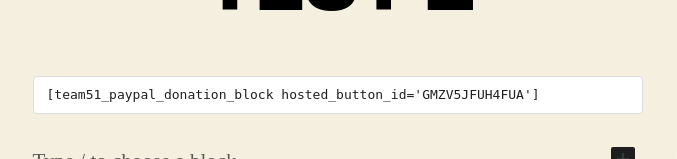
> See additional Shortcode arguments below.

## Once your block or shortcode has been added, you should then see it rendered on the page.
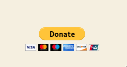

# Configuring the Button

You can change the image used for the button, its alt tag and also the images **title** tag. A live preview is shown of the button, so you can see how it will look on your site directly. 

# Debugging
When testing, the button can be placed in Sandbox mode. This will result in a simple notice being shown on the front end to let you know its still in Sandbox mode. Please ensure all active buttons have this disabled, else donations will not be made.

# Shortcode Arguments.

You can still control the button and its values when adding via a shortcode. The only required value is either the **PayerID/Email** or **Host Button ID**. The rest will use the same default values found in the block it set.

* **hosted_button_id** = The button ID 
* **donation_account** = The account which is hosting the button
* **button_image_url** = The fully resolved URL to the button it self.
* **button_title**     = The buttons *title* tag value.
* **button_alt**       = The buttons *alt* tag value

```html
[paypal_donation_block hosted_button_id='8df3df06dsuhi' button_image_url='https://www.url.tld/button.png' button_title='Donate with us to help them' button_alt='Acme Donation Link Button']
```

# Extending the Block

The block can be extend using the following hooks.

## team51_paypal_donation_block_settings

This allows for the changing of all settings that are used throughout the block. You have access to the block name(id) and all translatable strings used (front and backend).

```php
add_filter('team51_paypal_donation_block_settings', function(array $settings): array{

    // Sets the name/id the block is registered with.
    $settings['name'] = 'acme/paypal-donations-block-custom';

    // Sets the blocks icon (dashicons)
    $settings['icon'] = 'heart';

    // Sets the default button URL.
    $settings['defaultButtonUrl'] = esc_url( 'https://www.paypalobjects.com/en_US/i/btn/btn_donateCC_LG.gif' );


    // Translatable strings (used by JS and PHP).
    $settings['i18n']['blockName']                        = '...'; // The blocks title
    $settings['i18n']['blockDescription']                 = '...'; // The blocks description

    // Sandbox mode string
    $settings['i18n']['isSandboxMode']                    = '...'; // Label for sandbox mode checkbox
    $settings['i18n']['inSandboxMode']                    = '...'; // Message shown when in sandbox mode on front end.
    
    // Block EDIT input labels
    $settings['i18n']['buttonAltLabel']                   = '...'; // Block input label for buttons alt tag input fields label
    $settings['i18n']['buttonTitleLabel']                 = '...'; // Block input label for buttons title tag input fields label
    $settings['i18n']['buttonImageLabel']                 = '...'; // Block input label for buttons image url input fields label
    $settings['i18n']['donationAccountLabel']             = '...'; // Block input label for users account input fields label
    $settings['i18n']['donationButtonIDLabel']            = '...'; // Block input label for users hosted button id input fields label
    $settings['i18n']['buttonMediaLibraryButtonLabel']    = '...'; // Block input label for media library component for toggling button image
    $settings['i18n']['changeImageButtonLabel']           = '...'; // Block input label for media library change image button label.
    $settings['i18n']['removeImageButtonLabel']           = '...'; // Block input label for media library remove/reset image button label.

    return $settings;

}); 
```
## team51_paypal_donation_block_view

This allows for the customisation of how the button is rendered. By default the donation button is rendered as a div with all the attributes passed as `data-*` tags. If you are planing to change how this works, please ensure you either follow the same structure found in `assets/paypal-dontation-block-view.php` view file.

```php
add_filter('team51_paypal_donation_block_renderer_src', function(callable $view_callback): callable{
    /** @var callable(array $args): void */
    return 'some_custom_callback';
});
```
### View Args
The view callback is passed an array with the following values.
```php
$args = [
    'donationButtonID', // {string} The host_button_id value
    'donationAccount',  // {string} The account name or email address for business users
    'isSandbox',        // {bool}   Is in sandbox mode or not
    'buttonImage',      // {string} The buttons url
    'buttonTitle',      // {string} The buttons title tag value
    'buttonAlt',        // {string} The buttons alt tag value.
];
```

## team51_paypal_donation_block_renderer_src
This allows for supplying an alternative JS file used to render the block. For more details on how the Button should be rendered please see the PayPal Donations SDK documentation.

```php
add_filter('team51_paypal_donation_block_renderer_src', function(string $view_callback): string{
    return 'https://some.url.tld/assets/script.js';
});
```

## Plugin Architecture

This plugin is built using Composer for handling all autloading for PHP, NPM with Webpack and Grunt for building all JS and SCSS.

The 3 primary PHP classes `Block_Registration`, `PayPal_Donations` and `PayPal_Donations` all implement the `Bootable` interface. This interface ensures that these classes have a valid method called `register()`, this is used to add all needed scripts and styles. If you wish to extend this plugin, and have your custom class loaded and hooks called automatically, please add the class name to the `$classes` array found in  `paypal-donation-block.php`

## Change Log
* 0.1.0 - Initial Build.